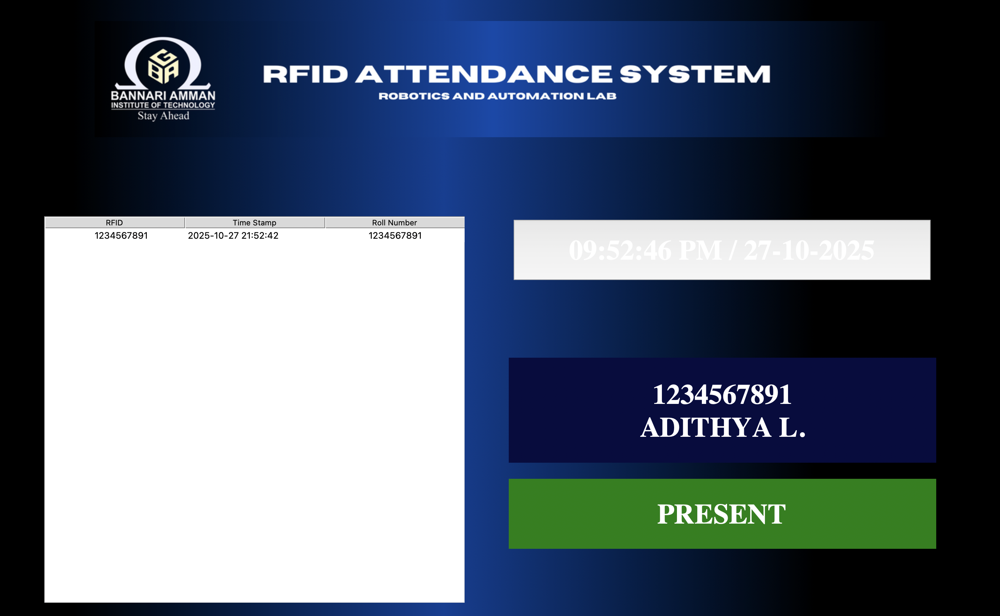
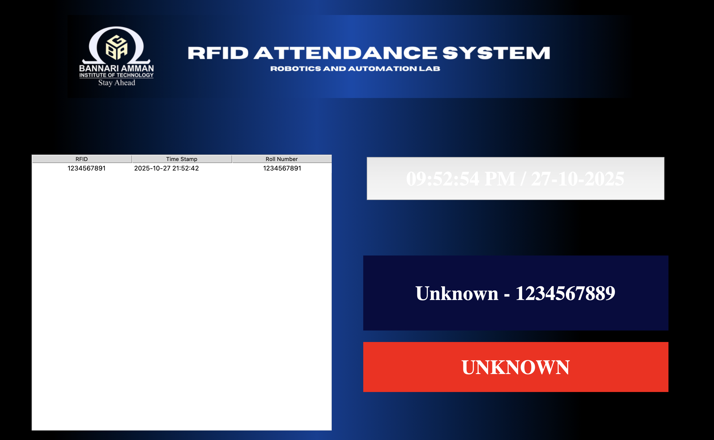
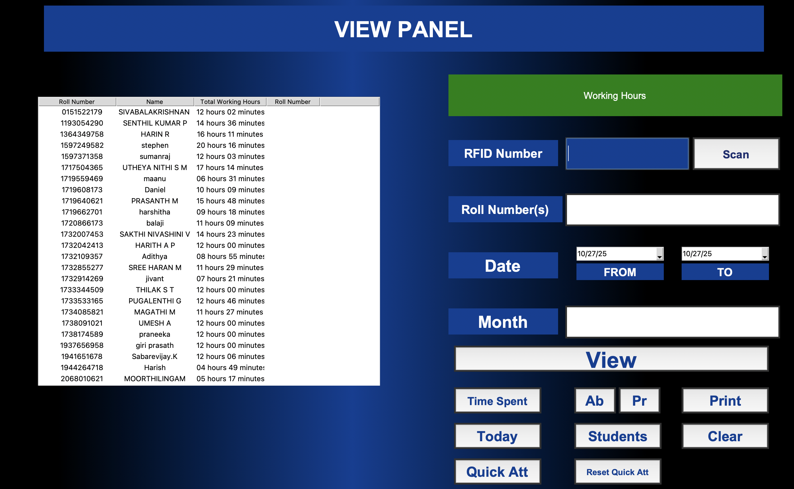
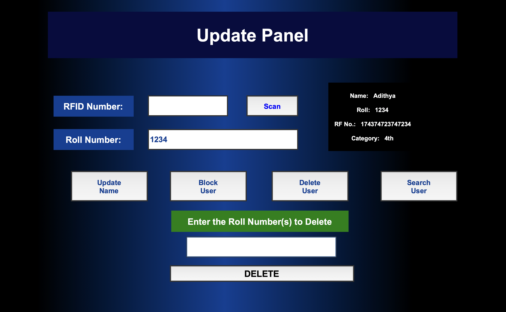
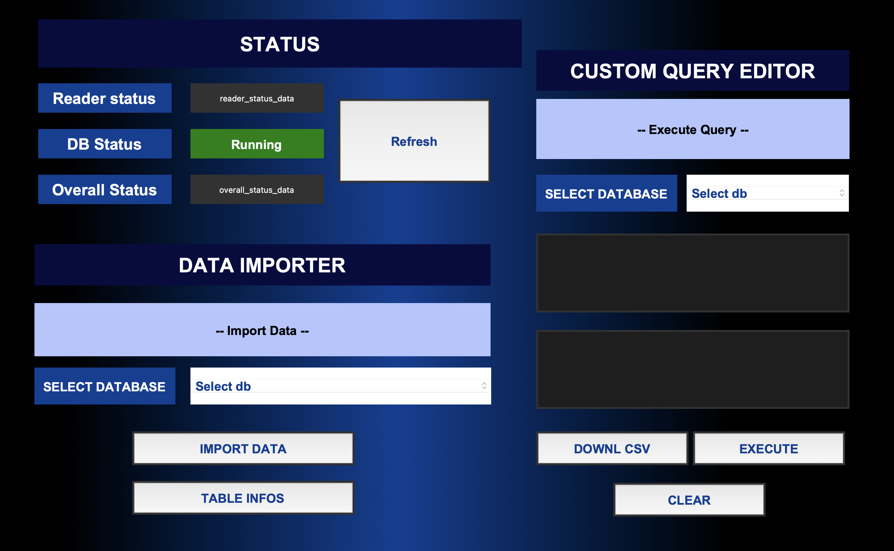
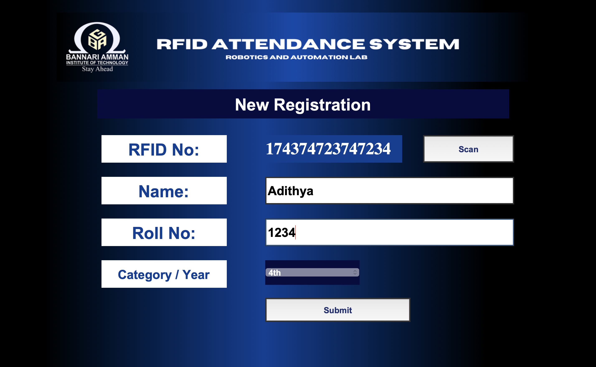

# RFID Attendance System

<div style="float: right; margin-left: 20px;">
  
</div>

The RFID Attendance System is a desktop-based application built using Python's Tkinter GUI framework and SQLite database. It facilitates automated attendance tracking through RFID card scanning, offering a user-friendly interface for managing students, attendance records, and device status. The system is designed for schools, colleges, and offices to streamline attendance marking, user registration, and monitoring using RFID technology.

### 🧭 Core Modules
- **Attendance Page**: Scan RFID cards to mark attendance in real-time.
- **Register Page**: Register new students or staff by linking their RFID cards.
- **View & Browse Page**: View, search, and filter attendance records and user details.
- **Update Page**: Modify user information, delete records, or block users.
- **RFID Status Page**: Monitor and troubleshoot connected devices, RFID module, and database connectivity.

💻 **Technologies Used**

| Component         | Technology                     |
|-------------------|--------------------------------|
| Frontend GUI      | Tkinter                        |
| Database          | SQLite                         |
| Hardware          | RFID USB Module                |
| Language          | Python 3                       |
| Libraries         | `tkinter`, `sqlite3`, `pynput`, `pyserial` (for RFID reader) |

## Project Setup

Follow these steps to set up and run the RFID Attendance System.


**Things to Do:**
---

- **Update the ASSETS_PATH** variable on line 31 to the absolute path of the frame0 folder in your project directory. For example: 
```bash
ASSETS_PATH = "C:/path/to/your/project/frame0"
```
**Step 1: Prepare the Environment**

```bash
# Clone the repository (replace with your actual repository URL if available)
git clone https://github.com/adhilogu/RFID-ATTENDANCE-SYSTEM.git
cd RFID-ATTENDANCE-SYSTEM

# Create a virtual environment (recommended)
pip install pynput pyserial python-dotenv
python -m venv venv

# Activate virtual environment
# On Windows:
venv\Scripts\activate

# On macOS/Linux:
source venv/bin/activate
```

**Step 2: Install Modules**
```bash
python rfid_installer_1_2.py
```
**Step 3: Run the program**
```bash
python main.py
```

**🧩 Things to Know**
---
- **Escape Key**: Acts as a back button across all pages.
- **Logo Click**: Navigates back to the previous page.
- **Attendance Protection**: Users cannot exit the attendance page without entering the admin password, preventing misuse or accidental closure.
- **Update the ASSETS_PATH** variable on line 31 to the absolute path of the frame0 folder in your project directory. For example: 
```bash
ASSETS_PATH = "C:/path/to/your/project/frame0"
```

**🔐 Access & Security**
---
- **Login Credentials**: Required to access system settings.
  - **Default Credentials**:
    - Username: `admin`
    - Password: `123`

🧪 **Testing Without RFID Module**
---
If you don't have an RFID module, you can test the system using your keyboard:

 1. Open the main project file (e.g., `main.py`) in a text editor.
  2. Navigate to lines 484 and 485.
  3. Uncomment the following lines:
   ```bash
   #listener = keyboard.Listener(on_press=on_key_press)
   #listener.start()
   ```

**RFID Reader Module Puchase Link:**
[RFID USB Reader Module Link](https://quartzcomponents.com/products/jt308-usb-rfid-card-reader-125khz-smart-id-card-reader-module?variant=45040512696554&country=IN&currency=INR&utm_medium=product_sync&utm_source=google&utm_content=sag_organic&utm_campaign=sag_organic?utm_source=google&utm_medium=FreeListings&gad_source=1&gad_campaignid=21214248935&gbraid=0AAAAACPPFdOETU3N5SJkqL-Yv6olEUfVw&gclid=Cj0KCQjwsPzHBhDCARIsALlWNG0VVxICrXYzZA6kolWEGfaeONPUvi8g0nP_uqU90i587w1IhbcldYQaAlQIEALw_wcB)


## [Snapshots of the project]


Hone page


Attendance Marking Page


Non-Register user Marking Attendance


View page 


Update page


Status page (Checks all the connectivity)


Registering a User


Login Page


## 📧 Support

<div style="text-align: left;">
  
  <p>Email: <a href="mailto:adhilogu2004@gmail.com">adhilogu2004@gmail.com</a></p>
</div>


[](https://www.linkedin.com/in/adithya-loganathan-a47218283/)
[](https://www.instagram.com/adithyaloganathanh/?hl=en)
[](https://github.com/adhilogu)


